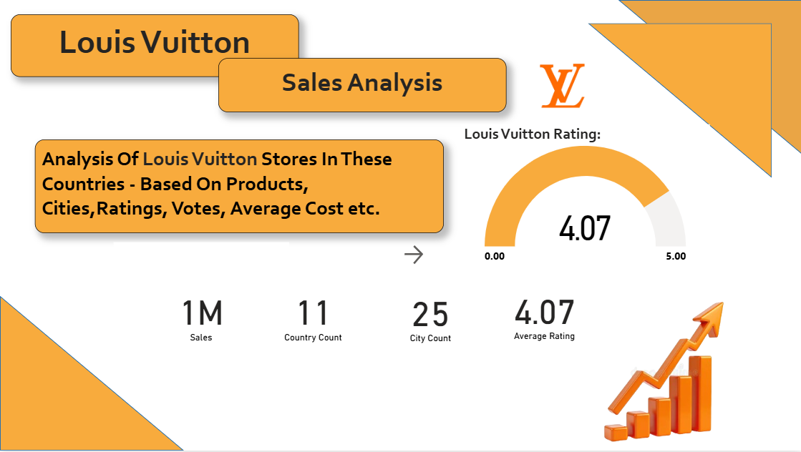
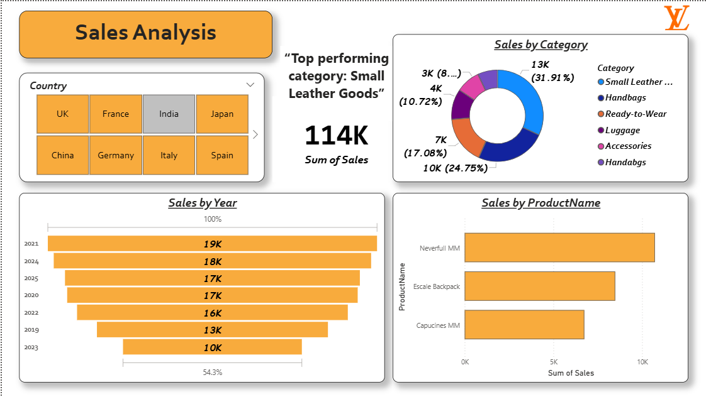
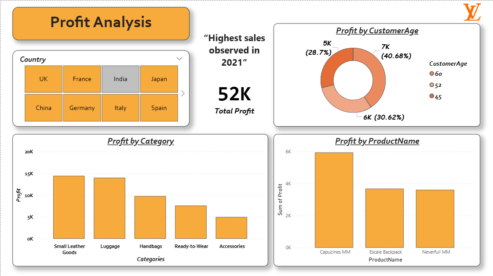
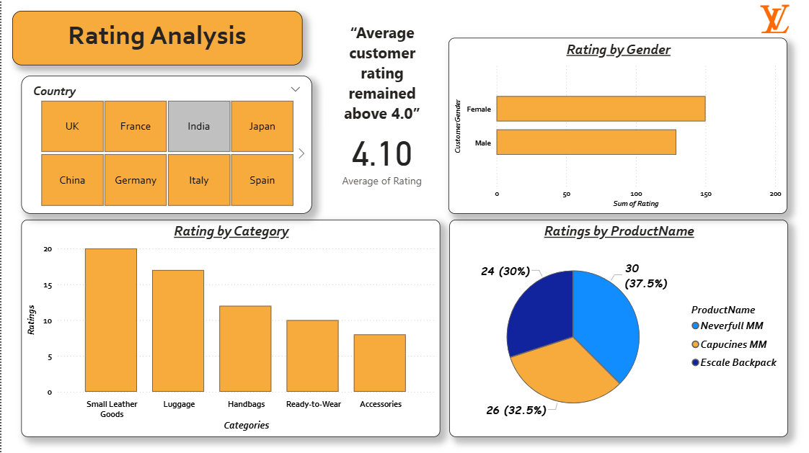

# 📊 LV Analytics Dashboard



An interactive and visually engaging business intelligence dashboard developed using Power BI to transform raw data into actionable insights.

---

<div align="center">

[](https://www.linkedin.com/posts/prasadaryan9354_powerbi-dataanalytics-businessintelligence-ugcPost-7462874244071190529-ytpy/?utm_source=share&utm_medium=member_desktop&rcm=ACoAAGiDoxkByomHC1vew9gmGHAtd4pqmlEzQjY)

[](https://github.com/thearyanprasad/LV-Analytics-Dashboard)

</div>

---

# 🚀 Project Overview

The LV Analytics Dashboard was created to analyze and visualize business performance through clean and interactive reporting.

This project focuses on presenting meaningful insights using data visualization, KPI tracking, and trend analysis while simplifying complex datasets into easy-to-understand reports for better decision-making.

---

# 🎯 Problem Statement

Businesses generate large amounts of raw data daily, making it difficult to identify trends, monitor KPIs, and make informed decisions efficiently.

This dashboard was developed to convert raw business data into meaningful visual insights through interactive analytics and reporting.

---

# 🛠️ Tech Stack

- Power BI
- SQL
- Python
- Excel

---

# ✨ Features

- 📈 Interactive KPI Dashboard
- 📊 Dynamic Charts & Visualizations
- 🎯 Business Performance Tracking
- 🔍 Data Filtering & Slicers
- 📉 Trend Analysis
- 🧹 Data Cleaning & Transformation
- 🎨 Clean and Professional UI Design

---

# 📷 Dashboard Preview

## 🏠 Dashboard Home


---

## 📈 Analytics Overview


---

## 📊 Insights & Reporting


---

## 📉 Performance Analysis


---

# 📌 Key Insights

- Identified business performance trends through KPI tracking
- Improved data readability using interactive visualizations
- Enabled faster decision-making through dashboard reporting
- Applied analytical thinking and storytelling with data

---

# 💡 Key Learnings

Through this project, I improved my skills in:

- Data Visualization
- Dashboard Designing
- Data Cleaning
- Business Analytics
- Analytical Thinking
- Storytelling with Data

---

# 🔗 Project Links

## 🌐 LinkedIn Post
[View Project Post](https://www.linkedin.com/posts/prasadaryan9354_powerbi-dataanalytics-businessintelligence-ugcPost-7462874244071190529-ytpy/?utm_source=share&utm_medium=member_desktop&rcm=ACoAAGiDoxkByomHC1vew9gmGHAtd4pqmlEzQjY)

---

## 💻 GitHub Repository
[View Repository](https://github.com/thearyanprasad/LV-Analytics-Dashboard)

---

# 📂 Project Structure

```plaintext
LV-Analytics-Dashboard/
│
├── README.md
├── dashboard1.png
├── dashboard2.png
├── dashboard3.png
├── dashboard4.png
│
├── dashboard.pbix
└── dataset/
```

---

# 🎯 Future Improvements

- Real-time data integration
- Advanced analytics features
- Mobile responsive dashboard views
- Predictive analytics implementation

---

# 👨‍💻 Author

## Aryan Prasad

- 💻 GitHub: https://github.com/thearyanprasad
- 🔗 LinkedIn: https://www.linkedin.com/in/prasadaryan9354
- 📸 Instagram: https://www.instagram.com/madmello_aryan
- 📧 Email: prasadaryan.work@gmail.com

---

⭐ If you found this project interesting, consider giving it a star!
